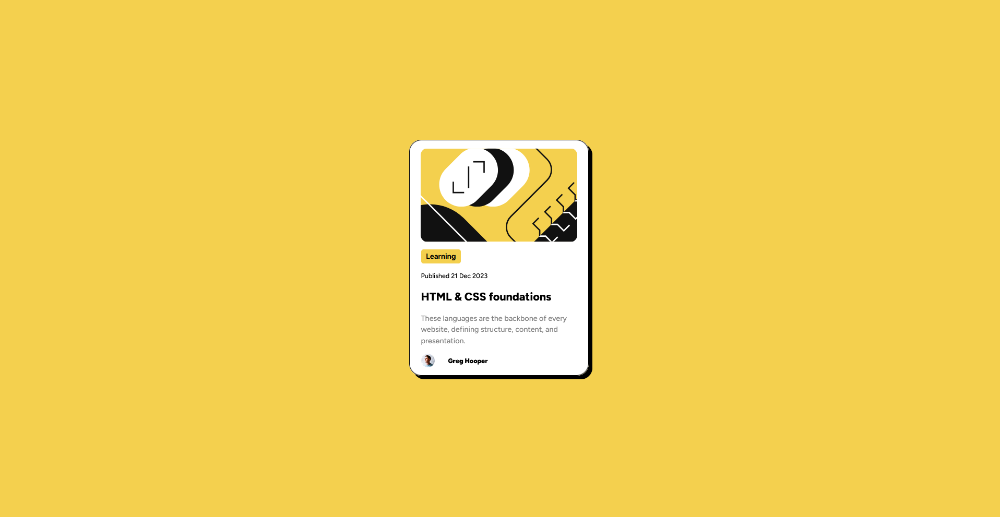

# Frontend Mentor - Blog preview card solution

This is a solution to the [Blog preview card challenge on Frontend Mentor](https://www.frontendmentor.io/challenges/blog-preview-card-ckPaj01IcS). Frontend Mentor challenges help you improve your coding skills by building realistic projects. 

## Table of contents

- [Overview](#overview)
  - [The challenge](#the-challenge)
  - [Screenshot](#screenshot)
  - [Links](#links)
- [My process](#my-process)
  - [Built with](#built-with)
  - [What I learned](#what-i-learned)
  - [Continued development](#continued-development)
  - [Useful resources](#useful-resources)
- [Author](#author)
- [Acknowledgments](#acknowledgments)

## Overview

### The challenge

Users should be able to:

- See hover and focus states for all interactive elements on the page

### Screenshot

### Links

- Solution URL: https://github.com/duojet2ez/blogPreviewCard
- Live Site URL: https://duojet2ez.github.io/blogPreviewCard/

## My process

### Built with

-html
-css

### What I learned

I learned how to import and work with google fonts, work with a figma file, read and understand figma file dimensions and what is meant by HUG. I made a container with height and width set to "fit-content" along with a max-width and max height. Makes container responsive to text inside container. Learned how to center a div vertically and horizontally in contraints of parent container. Added box-shadow and border-radius AND a basic media query to deal with mobile @ stated screen width. Also this project required basic hovering state.  
